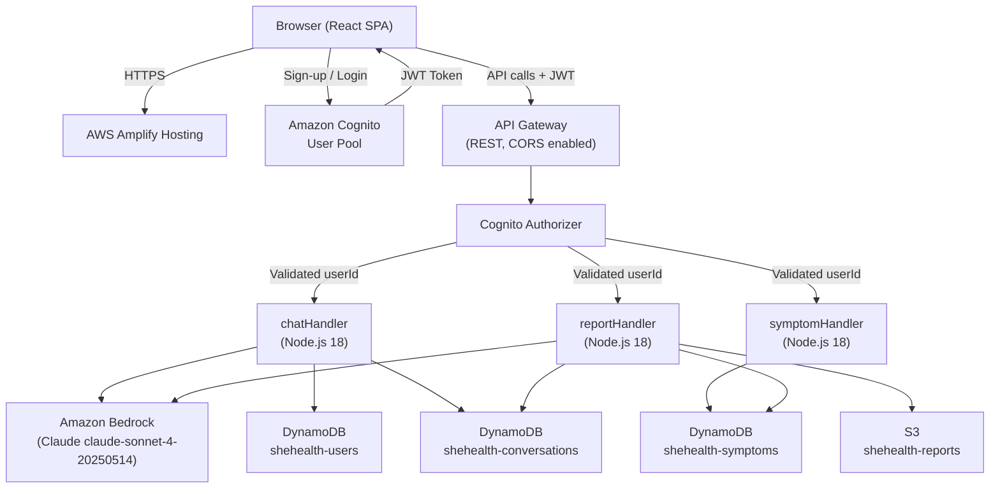
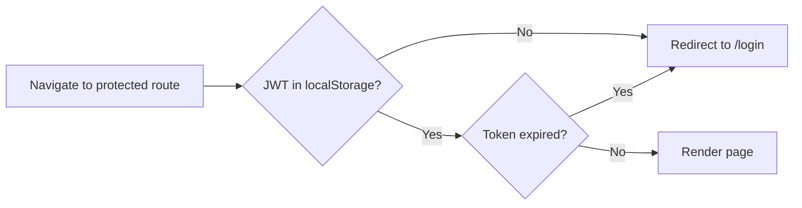
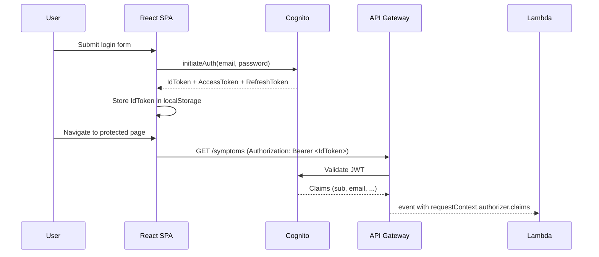
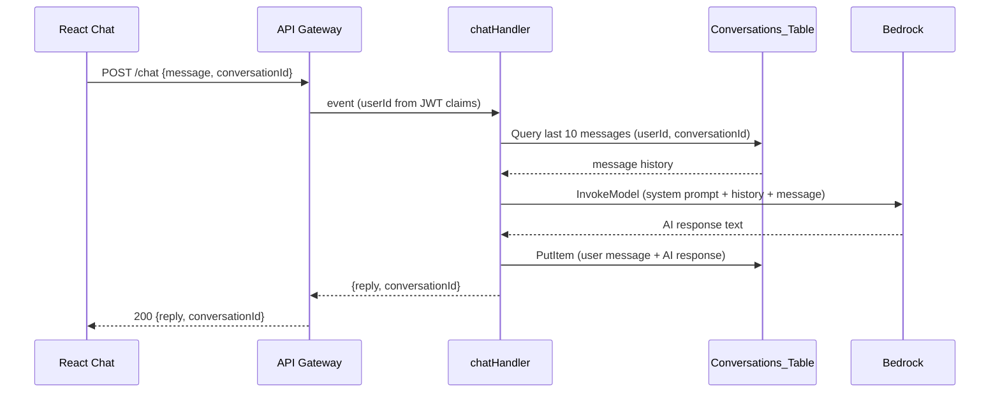

# Design Document: SheHealth App

## Overview

SheHealth is a women's health AI web application built entirely on AWS free-tier services. Authenticated users can chat with an AI health assistant, log symptoms, and generate weekly health summaries. The system uses a React SPA hosted on AWS Amplify, Amazon Cognito for auth, API Gateway + three Lambda functions for the backend, Amazon Bedrock (Claude claude-sonnet-4-20250514) for AI, DynamoDB for structured data, and S3 for report file storage.

The design prioritises data isolation (every query is scoped to the JWT `sub` claim), mobile-first UX, and a compassionate tone throughout the AI interactions.

---

## Architecture



### Key Design Decisions

- **Cognito Authorizer on API Gateway**: JWT validation happens at the gateway layer before any Lambda is invoked, satisfying Requirement 9.3 without duplicating auth logic in each function.
- **userId always from JWT `sub`**: All three Lambda functions extract `event.requestContext.authorizer.claims.sub` — never from the request body — enforcing data isolation (Requirement 9.1).
- **Single Conversations_Table for both chat and reports**: Reports are stored as a special record type (`recordType: "report"`) alongside chat messages, simplifying IAM and query patterns.
- **Pre-signed S3 URLs**: Reports are stored as text files in S3; the Lambda generates a 3600-second pre-signed URL on each GET /reports call rather than serving file bytes directly.

---

## Components and Interfaces

### React Frontend — Page Structure

```
src/
  pages/
    LandingPage.jsx          # Public — hero, sign-up/login CTAs
    RegisterPage.jsx         # Public — registration form
    LoginPage.jsx            # Public — login form
    HealthProfilePage.jsx    # Protected — first-login profile setup
    DashboardPage.jsx        # Protected — welcome, daily tip, quick actions
    ChatPage.jsx             # Protected — AI chat interface
    SymptomLoggerPage.jsx    # Protected — log and view symptoms
    ReportsPage.jsx          # Protected — generate and download reports
  components/
    ProtectedRoute.jsx       # Redirects unauthenticated users to /login
    LoadingSpinner.jsx       # Shared loading indicator
    ErrorMessage.jsx         # Plain-English error display
    Navbar.jsx               # Authenticated nav with logout
  services/
    authService.js           # Cognito sign-up, sign-in, sign-out, token retrieval
    apiService.js            # Axios instance with JWT Authorization header
  App.jsx                    # Router with protected/public route split
```

### Page Responsibilities

| Page | Route | Auth | Key Responsibilities |
|---|---|---|---|
| LandingPage | `/` | Public | Hero tagline, Sign Up / Log In buttons |
| RegisterPage | `/register` | Public | Registration form, redirect to `/profile` on success |
| LoginPage | `/login` | Public | Login form, redirect to `/profile` or `/dashboard` |
| HealthProfilePage | `/profile` | Protected | First-login profile form; redirect to `/dashboard` on save |
| DashboardPage | `/dashboard` | Protected | Welcome message, daily tip, quick-action buttons |
| ChatPage | `/chat` | Protected | Chat UI, typing indicator, disclaimer, clear button |
| SymptomLoggerPage | `/symptoms` | Protected | Log form, 30-day history list, empty state |
| ReportsPage | `/reports` | Protected | Generate button, report list with download links |

### ProtectedRoute Logic



### Auth Flow (Cognito)



---

## Lambda Function Designs

### chatHandler

**Trigger**: POST /chat

**Responsibilities**:
1. Extract `userId` from `event.requestContext.authorizer.claims.sub`
2. Parse `{ message, conversationId }` from request body
3. Query `shehealth-conversations` for the last 10 messages by `userId + conversationId`
4. Build Bedrock request with system prompt + conversation history + new user message
5. Call Bedrock `InvokeModel` with `anthropic.claude-sonnet-4-20250514`
6. Save user message and AI response to `shehealth-conversations`
7. Return `{ reply, conversationId }`

**System Prompt** (verbatim per Requirement 6.4):
> "You are SheHealth, a compassionate women's health AI assistant. You specialise in PCOS, endometriosis, thyroid disorders, menstrual health, hormonal imbalances, and women's mental wellness. Always be warm, empathetic, and judgment-free. Never diagnose. Always suggest consulting a doctor for serious concerns. Keep answers clear and simple."

**Error Handling**:
- Bedrock error → HTTP 500, plain-English message
- Missing env vars at cold start → log + HTTP 500



---

### symptomHandler

**Triggers**: POST /symptoms, GET /symptoms

**POST /symptoms responsibilities**:
1. Extract `userId` from JWT claims
2. Validate `symptomType` (enum: cramps, fatigue, mood, bloating, headache, other)
3. Validate `severity` (integer 1–10)
4. Save `Symptom_Log` to `shehealth-symptoms`
5. Return HTTP 201

**GET /symptoms responsibilities**:
1. Extract `userId` from JWT claims
2. Query `shehealth-symptoms` for entries within the last 30 days
3. Return array of `Symptom_Log` objects

**Validation errors**: HTTP 400 with descriptive message (Requirements 7.4, 7.5)

---

### reportHandler

**Triggers**: POST /reports/generate, GET /reports

**POST /reports/generate responsibilities**:
1. Extract `userId` from JWT claims
2. Query `shehealth-symptoms` for last 7 days
3. If no entries → HTTP 400 "No symptom data found for the last 7 days."
4. Call Bedrock to generate a plain-English `Weekly_Summary`
5. Save summary record to `shehealth-conversations` (`recordType: "report"`)
6. Upload summary text to S3 as `reports/{userId}/{reportId}.txt`
7. Return `{ reportId, summary, date }`

**GET /reports responsibilities**:
1. Extract `userId` from JWT claims
2. Query `shehealth-conversations` for `recordType: "report"` by `userId`
3. For each report, generate a pre-signed S3 URL (3600s expiry)
4. Return array of `{ reportId, date, summary, downloadUrl }`

---

## Data Models

### DynamoDB: shehealth-users

| Attribute | Type | Notes |
|---|---|---|
| `userId` | String (PK) | Cognito `sub` claim |
| `name` | String | Display name |
| `email` | String | |
| `age` | Number | |
| `healthConditions` | List\<String\> | e.g. ["PCOS", "thyroid"] |
| `cycleLength` | Number | Average cycle in days |
| `createdAt` | String | ISO 8601 |

Access pattern: `GetItem` by `userId`.

---

### DynamoDB: shehealth-symptoms

| Attribute | Type | Notes |
|---|---|---|
| `userId` | String (PK) | Cognito `sub` |
| `timestamp` | String (SK) | ISO 8601 — enables range queries |
| `symptomId` | String | UUID |
| `symptomType` | String | Enum: cramps, fatigue, mood, bloating, headache, other |
| `severity` | Number | Integer 1–10 |
| `notes` | String | Optional |

Access pattern: `Query` by `userId`, filter `timestamp >= now - 30d` (or 7d for reports).

---

### DynamoDB: shehealth-conversations

| Attribute | Type | Notes |
|---|---|---|
| `userId` | String (PK) | Cognito `sub` |
| `recordId` | String (SK) | `{conversationId}#{timestamp}` for chat; `report#{reportId}` for reports |
| `recordType` | String | `"message"` or `"report"` |
| `conversationId` | String | Groups messages in a session |
| `role` | String | `"user"` or `"assistant"` (messages only) |
| `content` | String | Message text or summary text |
| `reportDate` | String | ISO 8601 date (reports only) |
| `s3Key` | String | S3 object key (reports only) |
| `createdAt` | String | ISO 8601 |

Access patterns:
- Chat: `Query` by `userId`, filter `recordType = "message"` and `conversationId`, limit 10, sort by `createdAt` desc
- Reports: `Query` by `userId`, filter `recordType = "report"`

---

### S3: shehealth-reports

Object key pattern: `reports/{userId}/{reportId}.txt`

Content: plain-text weekly summary generated by Bedrock.

Pre-signed URL expiry: 3600 seconds.

---

## API Endpoint Definitions

All endpoints require `Authorization: Bearer <JWT>` header. API Gateway validates the token via Cognito Authorizer before invoking Lambda.

| Method | Path | Lambda | Request Body | Success Response |
|---|---|---|---|---|
| POST | /profile | chatHandler | `{ age, healthConditions, cycleLength }` | 200 `{ userId }` |
| GET | /profile | chatHandler | — | 200 `{ name, age, healthConditions, cycleLength }` |
| POST | /chat | chatHandler | `{ message, conversationId? }` | 200 `{ reply, conversationId }` |
| POST | /symptoms | symptomHandler | `{ symptomType, severity, notes? }` | 201 `{ symptomId }` |
| GET | /symptoms | symptomHandler | — | 200 `[ Symptom_Log ]` |
| POST | /reports/generate | reportHandler | — | 200 `{ reportId, summary, date }` |
| GET | /reports | reportHandler | — | 200 `[ { reportId, date, summary, downloadUrl } ]` |

### CORS Configuration

All routes: `Access-Control-Allow-Origin: *`, methods: GET, POST, OPTIONS, headers: Content-Type, Authorization.

---

## Environment Variable Configuration

### Lambda Functions (all three)

| Variable | Description |
|---|---|
| `BEDROCK_REGION` | AWS region for Bedrock client (e.g. `us-east-1`) |
| `DYNAMODB_TABLE_USERS` | DynamoDB table name for user profiles |
| `DYNAMODB_TABLE_SYMPTOMS` | DynamoDB table name for symptom logs |
| `DYNAMODB_TABLE_CONVERSATIONS` | DynamoDB table name for conversations and reports |
| `COGNITO_USER_POOL_ID` | Cognito User Pool ID |
| `COGNITO_CLIENT_ID` | Cognito App Client ID |
| `REPORTS_BUCKET` | S3 bucket name for report files |

Missing variable at cold start → log descriptive error, return HTTP 500 for all requests.

### React Frontend (build-time)

| Variable | Description |
|---|---|
| `REACT_APP_COGNITO_USER_POOL_ID` | Cognito User Pool ID |
| `REACT_APP_COGNITO_CLIENT_ID` | Cognito App Client ID |
| `REACT_APP_API_BASE_URL` | API Gateway base URL |

---

## Error Handling

| Scenario | HTTP Status | User-Facing Message |
|---|---|---|
| Missing / invalid JWT | 401 | "Your session has expired. Please log in again." |
| Invalid symptom severity | 400 | "Severity must be a number between 1 and 10." |
| Invalid symptomType | 400 | "Please select a valid symptom type." |
| No symptoms for report | 400 | "No symptom data found for the last 7 days." |
| Bedrock error | 500 | "Something went wrong generating your response. Please try again." |
| Missing env var | 500 | "Service configuration error. Please contact support." |
| Generic Lambda error | 500 | "Something went wrong. Please try again shortly." |

Frontend rules:
- Never expose stack traces, error codes, or AWS ARNs to the user.
- Display all errors in plain English inline (not alert dialogs).
- Show loading spinner during any in-flight API call.


---

## Correctness Properties

*A property is a characteristic or behavior that should hold true across all valid executions of a system — essentially, a formal statement about what the system should do. Properties serve as the bridge between human-readable specifications and machine-verifiable correctness guarantees.*

### Property 1: Valid registration inputs produce a saved account

*For any* combination of a non-empty name, a syntactically valid email address, and a password of at least 8 characters, submitting a registration request must succeed and the resulting account must be retrievable by that email.

**Validates: Requirements 1.1, 1.2**

---

### Property 2: Short passwords are always rejected

*For any* password string whose length is strictly less than 8 characters, the registration request must be rejected with an error describing the password requirement, and no account must be created.

**Validates: Requirements 1.4**

---

### Property 3: Valid login returns a JWT containing the sub claim

*For any* registered user with valid credentials, a login request must return a JWT token that contains a non-empty `sub` claim equal to the user's Cognito identity.

**Validates: Requirements 2.1**

---

### Property 4: Invalid credentials are always rejected

*For any* credential pair where the email is not registered or the password does not match, the login request must return an error and must not return a JWT token.

**Validates: Requirements 2.2**

---

### Property 5: API requests always carry the Authorization header

*For any* API call made by the authenticated frontend, the outgoing HTTP request must include an `Authorization: Bearer <token>` header containing the stored JWT.

**Validates: Requirements 2.3**

---

### Property 6: Unauthenticated requests are always rejected with HTTP 401

*For any* request to a protected endpoint that is missing a JWT, carries an expired JWT, or carries a tampered JWT, the system must return HTTP 401 before any Lambda function processes the request body.

**Validates: Requirements 6.1, 6.2, 7.1, 7.2, 8.1, 8.2, 9.3**

---

### Property 7: Health profile userId always equals JWT sub

*For any* profile save request, the `userId` stored in the Users_Table must equal the `sub` claim from the JWT — regardless of any userId value present in the request body.

**Validates: Requirements 3.3, 9.1**

---

### Property 8: Chat context is capped at the last 10 messages

*For any* conversation that contains N messages (N ≥ 10), the message history passed to the Bedrock request must contain exactly 10 messages, ordered by timestamp ascending.

**Validates: Requirements 6.3**

---

### Property 9: Bedrock request always includes the exact system prompt

*For any* valid chat request, the payload sent to Bedrock must contain the system prompt string specified in Requirement 6.4 verbatim.

**Validates: Requirements 6.4**

---

### Property 10: Chat exchange is persisted with all required fields

*For any* successful chat exchange, both the user message record and the assistant response record saved to the Conversations_Table must contain: `userId`, `conversationId`, `role`, `content`, and `createdAt` (ISO 8601 timestamp).

**Validates: Requirements 6.5, 6.6**

---

### Property 11: Symptom log is persisted with all required fields

*For any* valid POST /symptoms request, the record saved to the Symptoms_Table must contain: `userId` (equal to JWT sub), `timestamp` (ISO 8601), `symptomType` (valid enum value), `severity` (integer 1–10), and `symptomId` (non-empty string).

**Validates: Requirements 7.3, 9.1**

---

### Property 12: Severity outside 1–10 is always rejected

*For any* POST /symptoms request where `severity` is not an integer in the closed range [1, 10] (including non-numeric values, 0, and values > 10), the handler must return HTTP 400 with a descriptive error message and must not write to the database.

**Validates: Requirements 7.4**

---

### Property 13: Invalid symptomType is always rejected

*For any* POST /symptoms request where `symptomType` is not one of {cramps, fatigue, mood, bloating, headache, other}, the handler must return HTTP 400 with a descriptive error message and must not write to the database.

**Validates: Requirements 7.5**

---

### Property 14: GET /symptoms returns only the last 30 days

*For any* user who has symptom logs spanning more than 30 days, a GET /symptoms request must return only entries whose `timestamp` is within the last 30 days, and must never return entries older than that.

**Validates: Requirements 7.6**

---

### Property 15: Report generation queries only the last 7 days of symptoms

*For any* POST /reports/generate request, the symptom data passed to Bedrock must contain only entries whose `timestamp` is within the last 7 days for the authenticated user.

**Validates: Requirements 8.3, 8.4**

---

### Property 16: Report generate-then-retrieve round trip

*For any* user who successfully generates a report, a subsequent GET /reports request must return a list that includes that report, with a non-empty `summary`, a valid `date`, and a non-empty `downloadUrl`.

**Validates: Requirements 8.5, 8.6**

---

### Property 17: Pre-signed URLs are configured with 3600-second expiry

*For any* report download URL generated by the reportHandler, the URL's expiry parameter must be exactly 3600 seconds from the time of generation.

**Validates: Requirements 9.4**

---

### Property 18: All DB queries are scoped to the authenticated user's ID

*For any* two distinct users A and B, a data retrieval request authenticated as user A must never return records whose `userId` equals user B's `sub`.

**Validates: Requirements 9.2**

---

### Property 19: Missing environment variable causes HTTP 500 on all requests

*For any* Lambda invocation where one or more required environment variables are absent, the function must return HTTP 500 and log a descriptive error message identifying the missing variable.

**Validates: Requirements 11.1, 11.3**

---

## Testing Strategy

### Dual Testing Approach

Both unit tests and property-based tests are required. They are complementary:

- Unit tests catch concrete bugs at specific inputs and verify integration points.
- Property-based tests verify universal correctness across the full input space.

### Unit Tests

Focus areas:
- Specific examples: valid registration, login, profile save, symptom log, report generation
- Integration points: API Gateway → Lambda event shape, DynamoDB response parsing, Bedrock response parsing
- Edge cases: duplicate email, empty symptom list for report, expired JWT, missing env vars
- Error conditions: Bedrock failure, DynamoDB write failure

Avoid writing unit tests that duplicate what property tests already cover (e.g. don't write 20 unit tests for severity validation when one property test covers the full integer range).

### Property-Based Tests

**Library**: [fast-check](https://github.com/dubzzz/fast-check) (JavaScript/TypeScript, works with Jest/Vitest)

**Configuration**: Each property test must run a minimum of **100 iterations**.

**Tag format** (comment above each test):
```
// Feature: shehealth-app, Property <N>: <property_text>
```

**Property test mapping**:

| Property | Test Description | Arbitraries |
|---|---|---|
| P1 | Valid registration inputs produce a saved account | `fc.record({ name: fc.string({minLength:1}), email: fc.emailAddress(), password: fc.string({minLength:8}) })` |
| P2 | Short passwords are always rejected | `fc.string({maxLength:7})` for password |
| P3 | Valid login returns JWT with sub | Registered user credentials |
| P4 | Invalid credentials are rejected | Random email/password pairs not matching any account |
| P5 | API requests carry Authorization header | Any API call via apiService |
| P6 | Unauthenticated requests return 401 | Missing/expired/tampered JWT strings |
| P7 | Profile userId equals JWT sub | Random profile payloads with mismatched body userId |
| P8 | Chat context capped at 10 messages | `fc.array(messageArb, {minLength:10, maxLength:50})` |
| P9 | Bedrock request contains exact system prompt | Any chat message input |
| P10 | Chat exchange persisted with required fields | Random message strings, random conversationIds |
| P11 | Symptom log persisted with required fields | Valid symptom inputs |
| P12 | Severity outside 1–10 rejected | `fc.integer().filter(n => n < 1 || n > 10)` + non-numeric strings |
| P13 | Invalid symptomType rejected | `fc.string().filter(s => !VALID_TYPES.includes(s))` |
| P14 | GET /symptoms returns only last 30 days | Symptom logs with timestamps spanning 0–90 days ago |
| P15 | Report queries only last 7 days | Symptom logs spanning 0–30 days ago |
| P16 | Report round trip | Any user with ≥1 symptom in last 7 days |
| P17 | Pre-signed URL expiry is 3600s | Any reportId |
| P18 | DB queries scoped to authenticated user | Two distinct users with overlapping symptom types |
| P19 | Missing env var returns 500 | `fc.subarray(REQUIRED_ENV_VARS, {minLength:1})` to omit |

### Test File Structure

```
tests/
  unit/
    chatHandler.test.js
    symptomHandler.test.js
    reportHandler.test.js
    authService.test.js
    apiService.test.js
  property/
    registration.property.test.js
    auth.property.test.js
    chat.property.test.js
    symptoms.property.test.js
    reports.property.test.js
    security.property.test.js
    config.property.test.js
```
